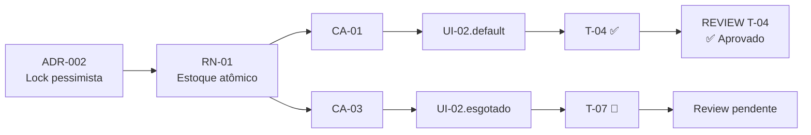

# Matriz de rastreabilidade SDD

Gerar a matriz cruzada que conecta arquitetura (ADRs) → regras de negócio (RNs) → critérios de aceite (CAs) → telas (UIs, quando houver) → tarefas (Ts) → reviews (Rs) → testes.

Artefato alvo: $ARGUMENTS

## O que fazer

### Passo 1 — Localizar os artefatos

Se o usuário não passou um PRD específico, procure no projeto:

- **Arquitetura**: `docs/architecture/*.md` ou similares
- **PRDs**: `docs/prds/*.md` ou `PRD-*.md`
- **SPEC-UI**: `docs/prototype/SPEC-UI-*.md` — opcional, só existe em projetos com interface
- **Planos**: `docs/plans/*.md` ou `PLAN-*.md`
- **Reviews**: `docs/reviews/*.md` ou `REVIEW-*.md`

Se houver mais de um PRD, pergunte qual analisar. Não tente fazer todos de uma vez.

### Passo 2 — Extrair IDs

Para o PRD escolhido:

- **Regras de negócio**: `RN-01`, `RN-02`, ... (procurar padrão `RN-\d+`)
- **Cenários Gherkin**: `Cenário [CA-01]:`, `Cenário [CA-02]:`, ...
- **ADRs referenciados**: ocorrências de `ADR-\d+` no PRD

Para o plano correspondente:

- **Tarefas**: `T-01`, `T-02`, ...
- **Campos de rastreabilidade**: `**Implementa:** RN-XX`, `**Valida:** CA-XX`, `**Decisões base:** ADR-XX`
- **Status de cada tarefa**: campo `**Status:**` de dentro do bloco `#### T-XX`, com um de quatro valores literais — `Pendente` / `Em andamento` / `Concluído` / `Bloqueado` (ver `templates/id-conventions.md`). Três cuidados de leitura:
  - O `**Status:**` do **cabeçalho do plano** é status de documento (`Rascunho` / `Em execução` / `Concluído`), não de tarefa. Ignorar — só contam as ocorrências dentro de um bloco de tarefa
  - O bloco da tarefa é a fonte de verdade; a tabela de Histórico da seção 11 é o registro. Se divergirem, reportar como inconsistência em vez de escolher uma
  - Valor fora do vocabulário é gap de estado, não estado desconhecido — reportar a grafia encontrada em vez de interpretá-la

Para a arquitetura:

- **ADRs definidos**: `ADR-\d+`

Para a SPEC-UI, quando existir:

- **Telas**: `UI-01`, `UI-02`, ...
- **Estados**: sufixos como `UI-02.erro`, `UI-02.vazio`
- **Mapeamento declarado**: quais `RN-XX` e `CA-XX` cada tela cobre
- **Lacunas já registradas** na seção 8 do documento

Se não houver SPEC-UI, **não tratar como lacuna** — projetos sem interface legitimamente não têm. Omitir as colunas de UI da matriz.

Para os reviews (em `docs/reviews/`):

- **Relatórios existentes**: arquivos `REVIEW-T-XX-*.md`
- **Findings**: `R-01`, `R-02`, ... com severidade (Bloqueante / Importante / Sugestão)
- **Recomendação final**: Aprovado / Aprovado com ressalvas / Bloqueado
- **Tarefas associadas**: cada review carrega `T-XX` no nome

### Passo 3 — Construir e mostrar a matriz

Apresente em três tabelas + um diagrama Mermaid:

#### Tabela 1: Rastreabilidade direta (do RN ao review)

| RN | Descrição (truncada) | Validado por (CA) | Implementado em (T) | Decisão base (ADR) | Status do review |
|----|---------------------|-------------------|---------------------|---------------------|------------------|
| RN-01 | Estoque atômico... | CA-01, CA-03 | T-04, T-07 | ADR-002 | T-04 ✅ Aprovado, T-07 ⚠️ R-02 pendente |
| RN-02 | Limite de compra... | CA-02 | T-05 | — | T-05 ⛔ Bloqueado (R-01) |

#### Tabela 2: Cobertura reversa (do critério de aceite ao review)

| CA | Cenário | Valida (RN) | Acontece em (UI) | Implementado em (T) | Tem teste? | Review |
|----|---------|-------------|------------------|---------------------|------------|--------|
| CA-01 | Compra com sucesso | RN-01 | UI-02.default | T-04 | sim (integration) | ✅ |
| CA-02 | Limite excedido | RN-02 | UI-02.limite | T-05 | sim (unit) | ⛔ R-03 |

> A coluna **Acontece em (UI)** só aparece quando o projeto tem SPEC-UI. Omitir inteiramente caso contrário.

#### Tabela 3: Estado de execução por tarefa

A coluna **Status no plano** reproduz literalmente o valor do campo `**Status:**` da tarefa, sem traduzir nem decorar com emoji.

| Tarefa | Status no plano | Review existe? | Severidade máxima | Findings abertos |
|--------|-----------------|----------------|-------------------|------------------|
| T-01 | Concluído | Sim | — | 0 |
| T-04 | Concluído | Sim | Sugestão | R-04 |
| T-05 | Bloqueado | Sim | Bloqueante | R-01, R-03 |
| T-07 | Em andamento | Não | — | — |

#### Diagrama de rastreabilidade (Mermaid)

### Passo 4 — Apontar lacunas

Listar explicitamente:

- **RNs sem cenário**: regras declaradas no PRD que nenhum cenário Gherkin valida → **risco: regra não testada**
- **CAs sem tarefa**: cenários que nenhuma tarefa do plano se compromete a validar → **risco: critério órfão**
- **Ts sem rastro**: tarefas que não preencheram `Implementa:` nem `Valida:` → **risco: tarefa sem propósito claro** (pode ser legítimo se for estrutural — investigar)
- **ADRs citados mas inexistentes**: PRD ou plano cita ADR-X que não está na proposta arquitetural → **risco: referência quebrada**
- **ADRs nunca referenciados**: decisão arquitetural que nenhuma regra ou tarefa invoca → **risco: decisão sem impacto rastreável** (pode indicar over-engineering)
- **Tarefas concluídas sem review**: tarefas com `Status: Concluído` no plano mas sem arquivo `REVIEW-T-XX-*.md` correspondente → **risco: entrega não validada**
- **Reviews bloqueados em aberto**: tarefas com review de recomendação final `Bloqueado` sem round subsequente → **risco: trabalho parado sem ação**
- **Findings Bloqueantes em tarefas com `Status: Concluído`**: tarefa fechada mas review aponta bloqueio não resolvido → **inconsistência grave entre estado declarado e estado real**
- **Status fora do vocabulário**: campo `**Status:**` com grafia diferente de `Pendente` / `Em andamento` / `Concluído` / `Bloqueado` → **risco: tarefa invisível para os comandos de estado**; reportar a tarefa e a grafia encontrada
- **Status divergente do Histórico**: campo `**Status:**` da tarefa em desacordo com a coluna Status da seção 11 do plano → **risco: registro de execução não confiável**

Quando existe SPEC-UI, verificar também:

- **CAs de interface sem tela**: cenário com ator em tela que nenhuma `UI-XX` cobre → **risco: cenário sem onde acontecer**
- **Telas sem tarefa**: `UI-XX` na SPEC-UI que nenhuma tarefa do plano implementa → **risco: tela órfã**
- **Estados sem implementação**: estado especificado (`UI-02.esgotado`) que nenhuma tarefa declara em `Telas:` → **risco: caminho de erro sem tratamento**
- **Telas sem respaldo no PRD**: `UI-XX` que não mapeia para nenhum `RN-XX` nem `CA-XX` → **risco: escopo extra ou lacuna do PRD**
- **Lacunas da SPEC-UI ainda abertas**: itens da seção 8 do documento sem decisão registrada

### Passo 5 — Salvar (opcional)

Pergunte ao usuário se quer salvar a matriz como `docs/traceability/MATRIX-{nome_do_prd}.md` para versionar junto com os outros artefatos.

## Regra de ouro

Esta é uma análise estática dos artefatos — não invente links que não estão escritos. Se o plano não preencheu `Implementa:` em uma tarefa, marque como gap, não adivinhe a regra. Se uma tarefa `Concluído` não tem review, marque como gap — não assuma que está OK.
