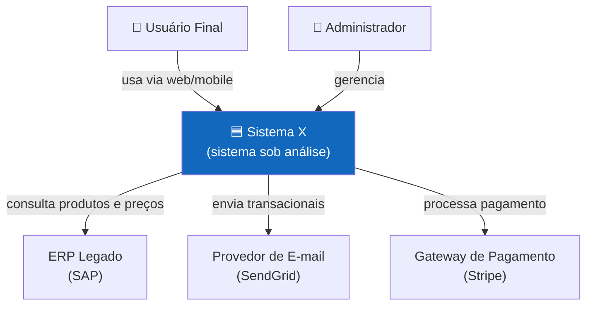
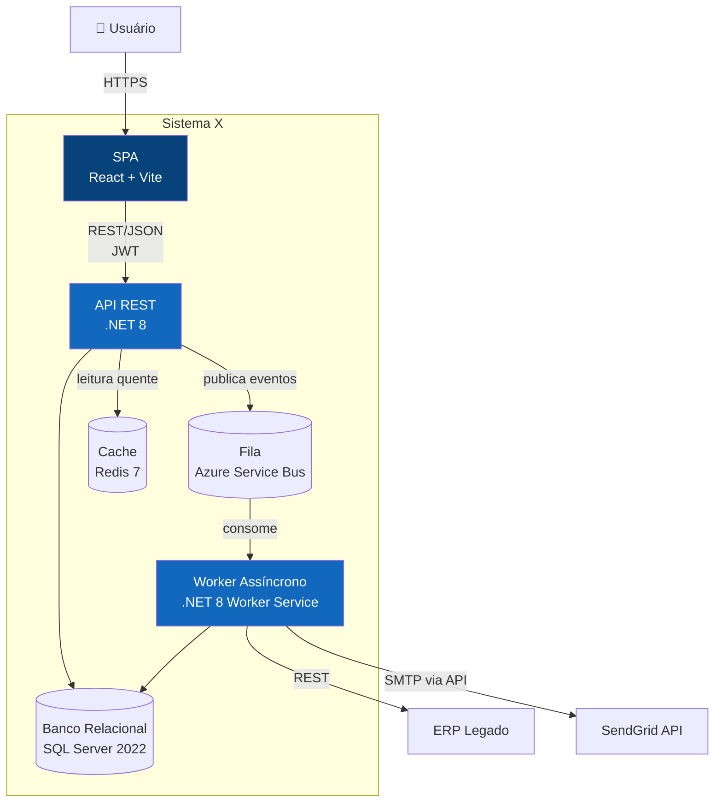
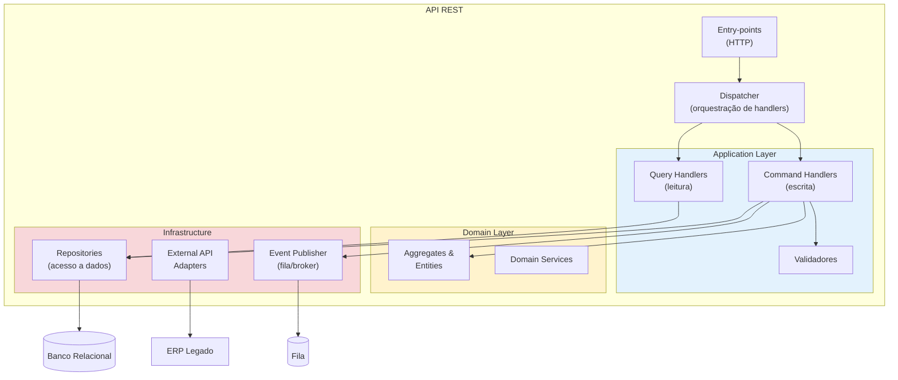
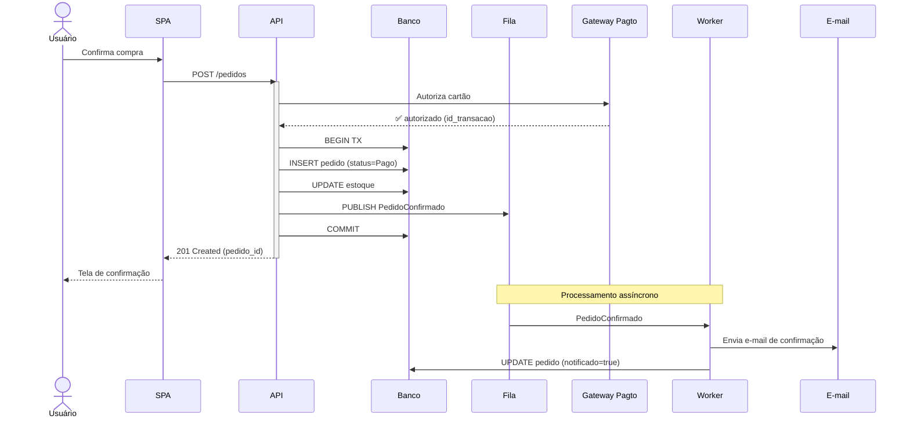
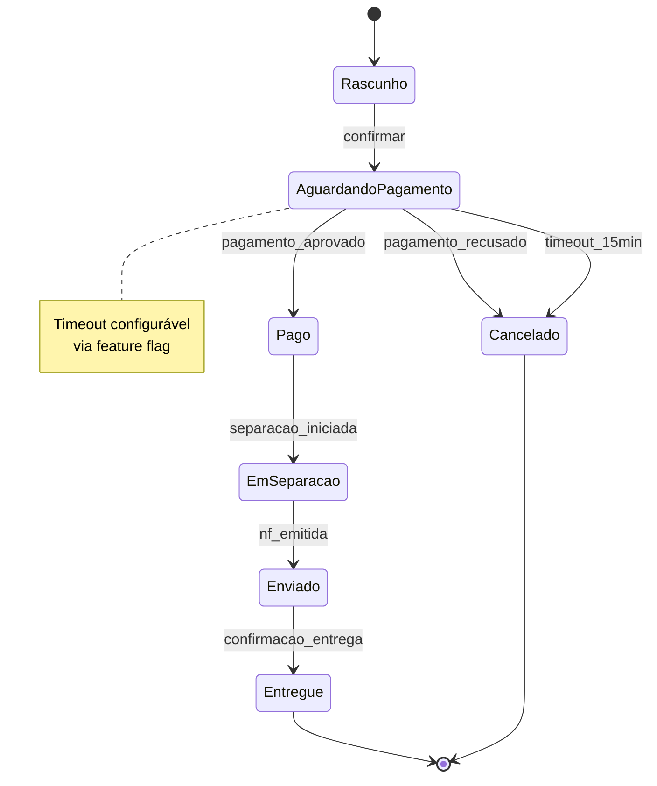

# Templates Mermaid — C4 Model

Templates prontos para os 4 níveis de C4. Use Mermaid `flowchart` para Context, Container e Component. Use `sequenceDiagram` para fluxos críticos. Nível 4 (Code) raramente compensa — o código já é a fonte de verdade.

## Nível 1 — Context

Mostra o sistema como caixa preta, com pessoas (atores) e sistemas externos com quem ele conversa. Não detalhe o que está dentro.

**Dicas:**
- Destacar o sistema sob análise com cor diferente
- Setas com verbo descritivo, não só linha
- Atores no topo, sistemas externos nas laterais ou embaixo
- Máximo 7±2 elementos para não saturar

## Nível 2 — Container

Mostra as unidades deployáveis dentro do sistema. Cada container é algo que roda separadamente (SPA, API, banco, fila, worker).

**Dicas:**
- Cada container ganha tecnologia entre ` ` no rótulo
- Bancos e filas com forma de cilindro `[(...)]`
- Setas com protocolo/formato quando relevante
- Sistemas externos fora do `subgraph`

## Nível 3 — Component

Zoom dentro de um container. Use apenas quando faz diferença para a decisão arquitetural. Geralmente só vale para a API ou para o container de domínio mais complexo.

Este exemplo usa nomes de padrão (não de biblioteca) — o objetivo é ilustrar agrupamento lógico, não prescrever uma arquitetura em camadas específica. Para uma versão com bibliotecas reais de uma stack .NET (MediatR, FluentValidation, EF Core), ver `${CLAUDE_PLUGIN_ROOT}/stacks/dotnet/c4-component-example.md`.

**Dicas:**
- Subgraphs para mostrar agrupamento lógico (camadas, módulos)
- Cores diferentes por camada ajudam a leitura
- Não detalhe classes individuais — é nível 3, não 4
- Este agrupamento em camadas é um exemplo, não uma recomendação — ver catálogo de atributos da skill quanto a quando Clean/Onion Architecture compensa

## Sequence Diagram para fluxos críticos

Use para 1-3 fluxos onde a arquitetura é não-trivial e explicar via diagrama de containers ficaria confuso. Fluxos CRUD óbvios não merecem.

**Dicas:**
- `activate`/`deactivate` para mostrar tempo de execução síncrono
- `Note` para marcar transição síncrono → assíncrono
- Setas tracejadas (`-->>`) para respostas
- Evite mais de 7 participantes — quebra a leitura

## Diagrama de Estados (state diagram) — opcional

Útil quando a arquitetura gira em torno de uma entidade com ciclo de vida não-trivial (pedido, contrato, ticket).

## Anti-padrões comuns

❌ **Diagrama explodido** — mais de 15 elementos no mesmo nível. Quebrar em sub-diagramas ou subir o nível.
❌ **Misturar níveis** — mostrar Container e Component no mesmo diagrama. Confunde.
❌ **Setas sem semântica** — só linhas sem rótulo. Setas devem dizer o que flui (HTTP, eventos, dados).
❌ **Detalhar implementação no Context** — Context é caixa-preta. Tecnologias entram a partir do Container.
❌ **Diagrama que não responde nenhuma pergunta** — se o leitor não consegue tirar uma conclusão arquitetural do diagrama, ele não merece estar na proposta.
