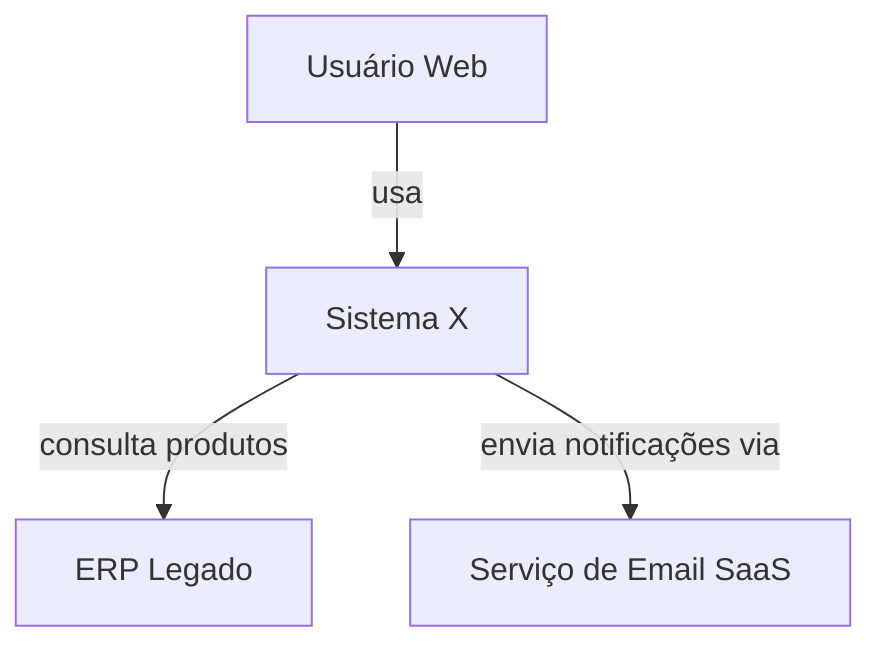
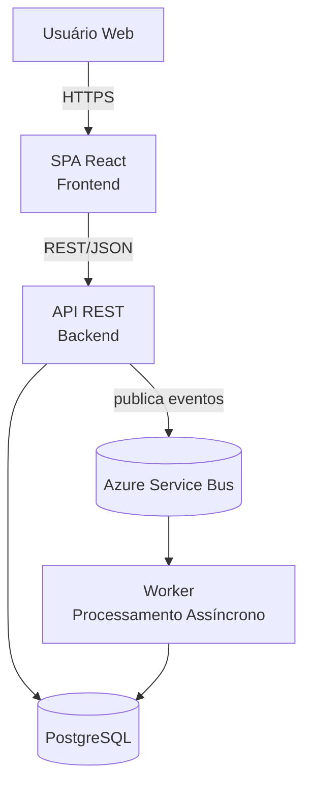
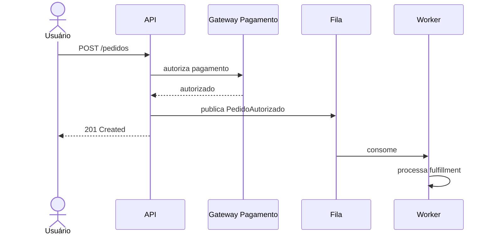

# Template — Proposta Arquitetural

Template completo a ser preenchido. Manter ordem das seções e marcações de obrigatoriedade. Seções não aplicáveis podem ser omitidas, exceto as numeradas como obrigatórias na skill.

As cercas de quatro crases que delimitam o bloco abaixo são o envelope deste arquivo — não fazem parte do documento gerado. As cercas de três crases dentro dele fazem.

---

````markdown
# Proposta Arquitetural — [Nome do projeto/sistema]

> Cliente: [nome ou "interno Leanwork"] · Documento gerado em [data] · Versão 0.1

## 1. Sumário executivo

[Para o público de negócio. Máximo 1 página. Responda:]
- O que estamos construindo, em uma frase
- Por que essa arquitetura (a frase-chave que justifica tudo)
- Principais riscos e como mitigamos
- Restrições de custo e prazo declaradas pelo cliente, quando houver (ver seção 4). Esta proposta não estima esforço nem cronograma — ver seção 12

---

## 2. Contexto e objetivos de negócio

### 2.1 Problema
[O que a solução resolve. Quem sente a dor. Qual o impacto de não resolver.]

### 2.2 Objetivos de negócio
[Resultado esperado, em frases curtas. Mensurável quando possível.]
- Objetivo 1
- Objetivo 2

### 2.3 Não-objetivos
[O que **não** é objetivo deste sistema. Evita scope creep e decisões para requisitos imaginários.]
- Não-objetivo 1

### 2.4 Usuários e cargas esperadas
[Perfis, volumes, padrões de uso. Ordem de grandeza basta.]

---

## 3. Atributos de qualidade prioritários

[Liste apenas os 2–4 atributos dominantes. Para cada um, especifique:]

### 3.1 [Atributo, ex.: Performance]
- **Meta concreta**: [ex.: p95 < 300ms para listagem de produtos]
- **Por quê é prioritário**: [referência ao objetivo de negócio que sustenta]
- **Como a arquitetura atende**: [frase curta, detalhe vem depois]

[Repita por atributo]

---

## 4. Restrições

[Tudo que é dado, não escolha.]

| Categoria | Restrição | Origem |
|---|---|---|
| Stack | Backend obrigatório em Go | Cliente impôs |
| Regulatório | Dados em solo nacional | LGPD + contrato |
| Infra | Cloud Azure | Padrão corporativo do cliente |
| Time | 4 devs, 1 sênior, 3 plenos | Time atual |

---

## 5. Decisões arquiteturais (ADRs resumidos)

[Lista numerada das decisões centrais. Cada uma com: contexto, decisão, justificativa, alternativas consideradas, consequências. **IDs `ADR-XX` são ponto de costura do pipeline SDD** — o PRD e o plano de execução referenciam essas decisões pelos IDs. Mantenha numeração sequencial; ADRs revogadas usam marcação `~~ADR-XX~~ (revogada por ADR-YY)` sem reúso de número.]

### ADR-001: [Título da decisão, ex.: Adotar arquitetura em camadas (monolito modular)]

- **Contexto**: [O que motivou essa decisão? Qual atributo de qualidade ou restrição forçou?]
- **Decisão**: [O que foi decidido. Frase afirmativa.]
- **Justificativa**: [Por quê — referência clara aos objetivos/atributos/restrições. Não vale "porque é boa prática".]
- **Alternativas consideradas**:
  - [Alternativa A] — descartada porque [razão]
  - [Alternativa B] — descartada porque [razão]
- **Consequências**:
  - Positivas: [...]
  - Negativas / dívidas plantadas: [...]

[Repita para 3–7 decisões centrais. Não documente decisões triviais.]

---

## 6. Visão arquitetural

[Aqui entram os diagramas C4. Diga primeiro qual nível você está usando e por quê. Templates Mermaid de C4 em `references/c4-mermaid-templates.md`.]

> **Níveis utilizados**: Context (1) + Container (2). Nível 3 omitido porque o sistema tem 3 containers diretos e cada um é internamente simples.

### 6.1 Contexto (C4 — Nível 1)

[Diagrama Mermaid com o sistema, atores e sistemas externos.]



[Texto curto explicando o diagrama. Não repita o que o diagrama mostra; explique o **porquê** dos relacionamentos.]

### 6.2 Containers (C4 — Nível 2)



[Para cada container, descreva: responsabilidade, tecnologia, justificativa da escolha tecnológica, modo de deploy.]

### 6.3 Componentes (C4 — Nível 3) — opcional

[Apenas para containers que merecem zoom. Geralmente o "API" ou o componente de domínio mais complexo. Ignore se for genérico.]

---

## 7. Fluxos críticos

[Para 1–3 fluxos onde a arquitetura é não-trivial, mostre um sequence diagram. Não documente fluxo CRUD óbvio.]

### 7.1 [Nome do fluxo, ex.: Processamento de pedido com pagamento]



[Texto curto: por que esse fluxo é assim e não de outro jeito.]

---

## 8. Trade-offs assumidos

[Seja explícito. Para cada par de atributos em tensão, diga qual lado priorizou e por quê.]

- **Consistência × Disponibilidade**: priorizamos disponibilidade — o cliente tolera ler dado 2s desatualizado, mas não tolera tela de erro. Por isso usamos cache e read replicas.
- **Simplicidade × Escalabilidade horizontal infinita**: priorizamos simplicidade. Monolito modular escala vertical até X RPS, suficiente para horizonte de 2 anos. Quebrar em microsserviços agora seria over-engineering.

---

## 9. Dívidas técnicas conscientes

[O que sabemos que estamos plantando agora e provavelmente vai precisar ser pago depois.]

- **Dívida 1**: [descrição]
  - **Quando vira problema**: [gatilho, ex.: "quando ultrapassar 50k usuários ativos diários"]
  - **Como pagar**: [estratégia futura, em alto nível]

---

## 10. Riscos e mitigações

| Risco | Impacto | Probabilidade | Mitigação |
|---|---|---|---|
| Integração com legado X falhar | Alto | Média | PoC de integração na primeira sprint |
| Time sem experiência em Y | Médio | Alta | Treinamento + pair programming nas primeiras semanas |

---

## 11. Próximos passos

[O que precisa acontecer para validar a arquitetura. Não é cronograma — é a sequência lógica de validação.]

1. Validação dos atributos de qualidade prioritários com PoC focado em [...]
2. Decisão sobre [aspecto ainda em aberto]
3. Setup de ambiente e CI/CD
4. Spike de risco em [integração crítica]

---

## 12. Apêndice — Aspectos não cobertos

[Tudo que ficou de fora deste documento e onde será tratado.]

- Detalhes de segurança aplicacional → documento separado de threat modeling
- Cronograma e estimativa → backlog/planejamento de sprint
- Detalhes de UI/UX → design system / Figma
````
