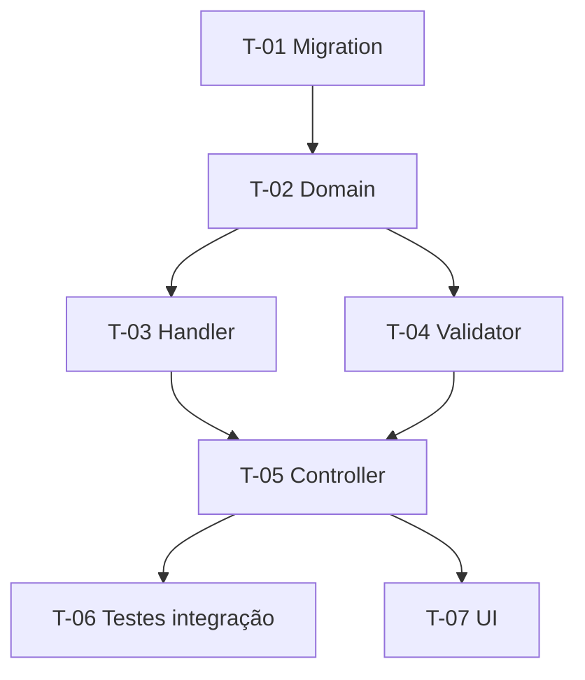

# Template — Plano de Execução

Template completo a ser preenchido. Manter hierarquia de headings e ordem das seções. Seções não aplicáveis podem ser omitidas, exceto as marcadas como obrigatórias.

---

```markdown
# Plano de Execução: [Título da feature/demanda]

**PRD de referência:** [link ou caminho para o arquivo do PRD]
**Cliente/Produto:** [Ultrafarma / LeanOps / Projeto X / ...]
**Stack:** [ex.: .NET 8, EF Core 8, SQL Server, React 18]
**Autor:** [nome]
**Data:** [AAAA-MM-DD]
**Status:** [Rascunho / Em execução / Concluído]

---

## 1. Resumo executivo *(obrigatória)*

[1 parágrafo: o que vamos construir e qual a estratégia geral de quebra. Ex.: "Implementação incremental começando pela camada de domínio, expondo via API ao final, com feature flag para liberação controlada."]

## 2. Estratégia de entrega *(obrigatória)*

[Como esse plano será executado: tudo de uma vez? Em fases? Há feature flag? Há dark launch?]

**Modelo de entrega:** [única release / incremental por fase / atrás de feature flag]

**Critério geral de "pronto":** [o que precisa estar verdadeiro para considerar a feature inteira concluída — geralmente: todos os critérios do PRD verificáveis, testes passando, code review aprovado, deploy em staging validado]

## 3. Premissas e decisões *(obrigatória se houver)*

Listar premissas que afetam o plano. Cada premissa precisa ser explícita — se virar falsa, o plano muda.

> ⚠️ **Premissa:** [descrição da premissa]
> ⚠️ **Premissa:** [outra premissa]

Decisões técnicas relevantes já tomadas (referenciar ADR se houver):

- **Decisão:** [ex.: Usaremos MediatR para os handlers] — *referência: ADR-007*

## 4. Mapa de dependências *(obrigatória se houver mais de 5 tarefas)*

Diagrama mostrando a ordem natural de execução e o que bloqueia o quê.



## 5. Fases *(obrigatória)*

Agrupar tarefas em fases lógicas. Uma fase é um conjunto de tarefas que entrega valor coerente e pode (em tese) ser interrompida sem deixar o sistema quebrado. Exemplo de fases típicas:

- **Fase 1 — Fundação:** migrations, entidades, contratos
- **Fase 2 — Lógica de negócio:** handlers, validators, regras
- **Fase 3 — Exposição:** controllers, endpoints, autenticação
- **Fase 4 — Interface:** UI, integrações com frontend
- **Fase 5 — Qualidade e observabilidade:** testes de integração, logging, métricas, feature flag

Adaptar conforme a natureza da feature. Greenfield pequeno pode ter 2 fases; feature grande pode ter 6.

### Fase 1 — [nome da fase]

**Objetivo da fase:** [1 frase]

**Critério de conclusão da fase:** [o que precisa estar verdadeiro para fechar a fase]

---

#### T-01 — [Título curto e imperativo da tarefa]

- [ ] **Status:** Pendente
- **Complexidade:** [Baixa / Média / Alta]
- **Depende de:** [nenhuma | T-XX, T-YY]
- **Implementa:** [RN-XX, RN-YY] *(regras de negócio do PRD que esta tarefa concretiza — vazio se for tarefa puramente estrutural)*
- **Valida:** [CA-XX, CA-YY] *(cenários Gherkin do PRD que ficarão verdes ao concluir — vazio se for tarefa preparatória)*
- **Decisões base:** [ADR-XX] *(decisões arquiteturais que esta tarefa materializa — opcional)*
- **Camadas/arquivos afetados:**
  - `src/Projeto.Domain/Entidades/Foo.cs` *(novo)*
  - `src/Projeto.Application/Features/Foo/Commands/CriarFoo/CriarFooHandler.cs` *(novo)*
  - `src/Projeto.Infrastructure/Persistence/Configurations/FooConfiguration.cs` *(novo)*

**Descrição:**
[O que essa tarefa faz, em 2-4 linhas. Explicar o "como" em alto nível — não código, mas direção. As regras de negócio implementadas já estão em **Implementa:**; aqui você pode aprofundar nuances de implementação.]

**Critério de aceite (testável):**
- [ ] [Critério 1 — verificável por teste ou inspeção objetiva]
- [ ] [Critério 2]

**Testes a escrever:**
- *Unit:* [descrever cenários — ex.: "Handler retorna sucesso quando comando válido", "Validator rejeita nome vazio"]
- *Integration:* [descrever cenários ligados a CA-XX — ex.: "POST /api/foo persiste no banco e retorna 201 (CA-01)"]
- *Não aplicável* se a tarefa for puramente estrutural (ex.: criação de pasta, ajuste de namespace).

**Riscos / pontos de atenção:**
- [ex.: "Tabela existente tem 2M de registros — migration precisa ser online"]
- [ex.: "Nome do campo conflita com palavra reservada em SQL Server — usar `[Order]` com escape"]

---

#### T-02 — [...]

[mesma estrutura]

---

### Fase 2 — [nome da fase]

[mesma estrutura, começando da próxima tarefa T-NN]

## 6. Testes transversais *(opcional)*

Testes que não pertencem a uma tarefa específica mas precisam existir antes do fechamento da feature.

- [ ] **Smoke test end-to-end:** [descrição]
- [ ] **Teste de carga:** [se aplicável, com cenário e limite esperado]
- [ ] **Teste de regressão:** [áreas adjacentes que precisam ser revalidadas]

## 7. Checklist de prontidão para produção *(obrigatória)*

Antes de marcar a feature como concluída, todos esses itens precisam estar verdadeiros:

- [ ] Todos os critérios de aceite do PRD verificados
- [ ] Cobertura de testes conforme padrão do projeto
- [ ] Code review aprovado por pelo menos 1 par
- [ ] Migrations testadas em ambiente espelhado (se houver)
- [ ] Logging estruturado nos pontos críticos
- [ ] Feature flag configurada (se modelo de entrega exigir)
- [ ] Documentação interna atualizada (README, CLAUDE.md, ADR se houver decisão nova)
- [ ] Validação em staging com PO/QA
- [ ] Rollback plan documentado (especialmente se houver migration destrutiva)

## 8. Rollback e contingência *(obrigatória se houver migration ou breaking change)*

[Plano de rollback caso a feature precise ser revertida em produção. Detalhar:
- Como reverter migrations (ou se são forward-only)
- Como desativar via feature flag
- Quais dados ficarão inconsistentes e como reconciliar]

## 9. Pontos de validação humana *(obrigatória)*

Tarefas onde o executor (especialmente se for agente de IA) DEVE parar e pedir confirmação antes de seguir:

- [ ] Após **T-XX** (migration criada) — revisar SQL gerado antes de aplicar em ambiente compartilhado
- [ ] Após **Fase N** (lógica de negócio pronta) — revisar regras implementadas com PO antes de expor via API
- [ ] Antes de **T-YY** (deploy em staging) — confirmar que feature flag está desligada por padrão

## 10. Questões em aberto *(opcional)*

Pontos que apareceram durante o planejamento e precisam ser resolvidos antes ou durante a execução.

- [ ] [pergunta] — *responsável: [nome]* — *bloqueia: T-XX*
- [ ] [pergunta] — *responsável: [nome]*

## 11. Histórico de execução *(preenchido durante a execução)*

Tabela atualizada à medida que tarefas são concluídas. Útil para retomar trabalho em outra sessão/ferramenta.

| Tarefa | Status | Concluída em | Commit | Observação |
|--------|--------|--------------|--------|------------|
| T-01   | ✅ Done | 2026-05-16   | `abc1234` | — |
| T-02   | 🔄 Doing | —          | —      | Aguardando review |
| T-03   | ⛔ Blocked | —        | —      | Depende de decisão sobre RN-05 |
```
