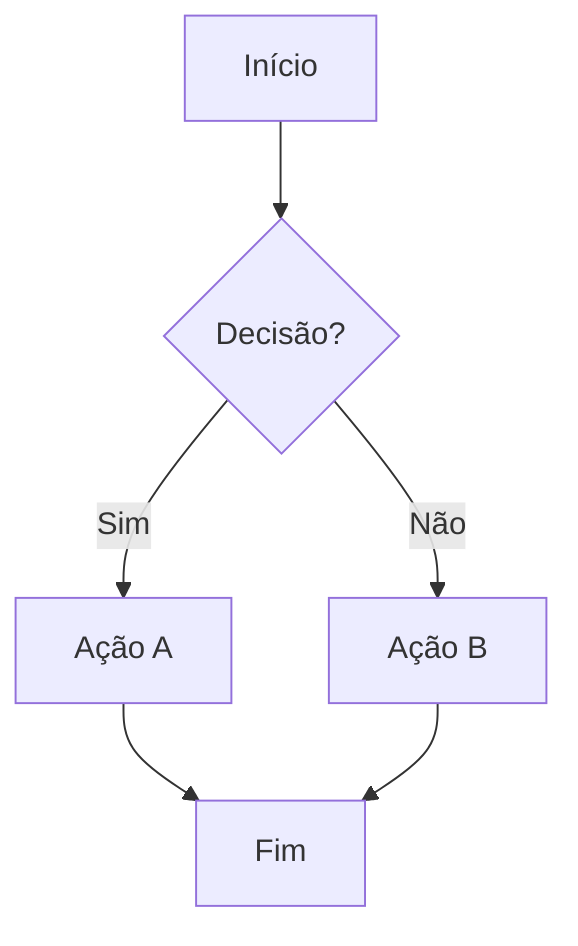
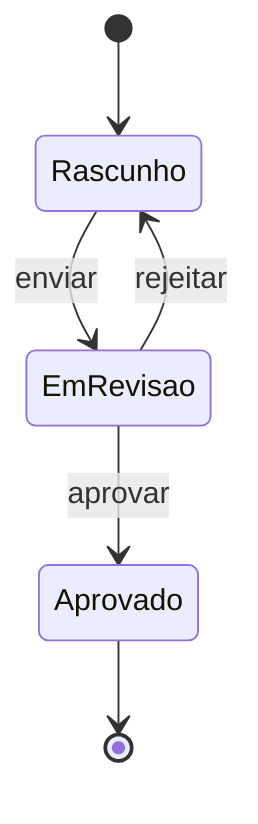
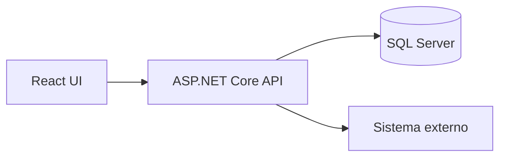

# Template — PRD (Product Requirement Document)

Template completo a ser preenchido. Manter hierarquia de headings e ordem das seções. Seções marcadas como obrigatórias não podem ser omitidas; opcionais podem.

---

```markdown
# PRD: [Título da demanda]

**Cliente/Produto:** [Ultrafarma / LeanOps / Projeto X / ...]
**Tipo:** [Epic / Feature / PBI]
**Autor:** [nome]
**Data:** [AAAA-MM-DD]
**Status:** [Rascunho / Em revisão / Aprovado]

---

## 1. Visão geral *(obrigatória)*

[1 parágrafo: o que é essa demanda, em linguagem que um dev novo entenderia em 30 segundos. Sem jargão de negócio sem explicar.]

## 2. Problema e contexto *(obrigatória)*

**Problema:** [qual dor concreta isso resolve]

**Contexto atual:** [como funciona hoje, se já existe algo]

**Impacto de não fazer:** [o que acontece se ignorarmos essa demanda]

## 3. Objetivo *(obrigatória)*

[1 frase descrevendo o resultado esperado. Verbo no infinitivo: "Permitir que...", "Reduzir...", "Automatizar...".]

### Métricas de sucesso *(opcional)*

[Se houver: como mediremos se a demanda atingiu o objetivo. Ex.: "Redução de 30% no tempo de busca", "100% das bulas sincronizadas em até 24h".]

## 4. Escopo *(obrigatória)*

### 4.1. Dentro do escopo

- [item 1]
- [item 2]

### 4.2. Fora do escopo

- [item 1 — incluindo o motivo, se ajudar]
- [item 2]

## 5. Personas e usuários impactados *(obrigatória se houver UI)*

| Persona | Papel | Como interage com a feature |
|---------|-------|----------------------------|
| [nome]  | [perfil] | [resumo] |

## 6. Hierarquia de entrega *(obrigatória)*

Sugestão de quebra em Epic → Feature → PBI para o Azure DevOps:

- **Epic:** [nome do épico — abrange a demanda inteira e tipicamente entrega valor de negócio mensurável]
  - **Feature:** [feature 1 — entregável funcional coerente]
    - **PBI:** [task 1.1 — pequena, executável em até alguns dias]
    - **PBI:** [task 1.2]
  - **Feature:** [feature 2]
    - **PBI:** [task 2.1]

> Esta é uma sugestão de quebra. O Product Owner pode reorganizar conforme prioridade e capacidade do time.

## 7. Fluxos *(obrigatória se houver interação)*

### 7.1. Fluxo principal



[Descrição textual do fluxo, passo a passo.]

### 7.2. Fluxos alternativos / de erro

[Cada um com seu próprio diagrama Mermaid se for complexo, ou descrição textual se for simples.]

## 8. Regras de negócio *(obrigatória)*

Numerar para facilitar referência cruzada nos critérios de aceite e no plano de execução. Quando uma regra existe por causa de uma decisão arquitetural, citar o ADR correspondente entre parênteses.

- **RN-01:** [descrição clara e verificável da regra]
- **RN-02:** [...] *(ADR-005)*
- **RN-03:** [...]

## 9. Critérios de aceite *(obrigatória)*

Em formato Gherkin, em português. Cada cenário recebe um ID `CA-XX` entre colchetes no nome, para ser referenciado por tarefas do plano de execução. Cada cenário deve ser independente e verificável.

```gherkin
Funcionalidade: [nome da funcionalidade]

  Cenário [CA-01]: [nome do cenário — o que está sendo validado]
    Dado que [contexto inicial] (RN-01)
    E [contexto adicional]
    Quando [ação do usuário ou evento]
    Então [resultado esperado] (RN-03)
    E [resultado adicional]

  Cenário [CA-02]: [outro cenário, ex.: caso de erro]
    Dado que [...]
    Quando [...]
    Então [...]
```

Cobrir pelo menos: caminho feliz, principais variações e os casos de erro mais prováveis. Ver `gherkin-examples.md` para exemplos calibrados.

## 10. Permissionamento *(obrigatória se houver controle de acesso)*

| Ação | Perfis autorizados | Observação |
|------|-------------------|------------|
| [ação] | [perfis]          | [se houver regra adicional] |

## 11. Integrações e dados *(obrigatória se aplicável)*

### 11.1. Sistemas envolvidos

- [Sistema X] — [tipo de integração: API REST, webhook, evento, fila, etc.]

### 11.2. Dados consumidos

[Quais dados a feature precisa ler, de onde vêm.]

### 11.3. Dados produzidos / persistidos

[O que será gerado, onde será armazenado.]

### 11.4. Eventos *(opcional)*

[Eventos disparados/consumidos, com nome e payload conceitual.]

## 12. Diagrama de estados *(opcional)*

Incluir quando a entidade principal tiver ciclo de vida não-trivial (ex.: pedido, ticket, contrato).



## 13. Arquitetura técnica *(opcional)*

Diagrama de alto nível mostrando como a feature se encaixa no sistema. Não detalhar classes ou implementação — isso é decisão do dev na execução.



## 14. Restrições e premissas *(opcional)*

- **Restrição:** [ex.: deve funcionar offline, deve responder em <500ms, etc.]
- **Premissa:** [ex.: assumimos que o cliente já tem cadastro no sistema X]

## 15. Riscos e dependências *(obrigatória)*

| Tipo | Descrição | Mitigação / Plano |
|------|-----------|-------------------|
| Risco | [descrição] | [como mitigamos] |
| Dependência | [item ou time] | [status / plano B] |

## 16. Questões em aberto *(opcional)*

Lista de pontos que precisam ser definidos antes ou durante a execução. Cada item tem um responsável.

- [ ] [pergunta] — *responsável: [nome]*
- [ ] [pergunta] — *responsável: [nome]*

## 17. Referências *(opcional)*

- [Link para conversa, e-mail, mockup, documento relacionado]
- [Link para proposta arquitetural, se houver: `docs/architecture/proposta-arquitetural.md`]
```
