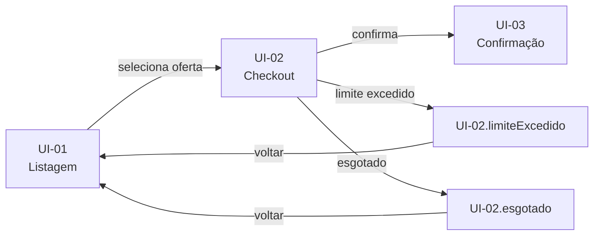

# Template — SPEC-UI (Especificação de Interface)

Documento produzido pela skill `prototype-leanwork`. Salvar como `docs/prototype/SPEC-UI-XXX-nome-kebab.md`, com **o mesmo número do PRD** correspondente.

Alvo: proporcional ao número de telas. Uma feature com 4 telas rende ~120 linhas; com 15 telas, ~400. Se passar disso, provavelmente o PRD é grande demais e deveria ter sido dividido.

As cercas de quatro crases que delimitam o bloco abaixo são o envelope deste arquivo — não fazem parte do documento gerado. As cercas de três crases dentro dele fazem.

---

````markdown
# SPEC-UI-XXX: [Título da feature, idêntico ao do PRD]

> **PRD de referência:** `docs/prds/PRD-XXX-nome.md`
> **Arquitetura de referência:** `docs/architecture/proposta-arquitetural.md`
> **Modo:** [Ingestão / Geração / Híbrido]
> **Artefato visual:** [caminho ou URL do protótipo]
> **Fidelidade:** [Wireframe / Alta fidelidade]
> **Autor:** [nome]
> **Data:** [AAAA-MM-DD]
> **Status:** [Rascunho / Em revisão / Aprovado]

---

## 1. Contexto de interface

**Arquétipo:** [Admin/dashboard | Site institucional | App de operação | E-commerce | Portal | Ferramenta interna]

**Dispositivo alvo:** [Desktop-first | Mobile-first | Mobile-only | Responsivo pleno]

**Stack de frontend:** [extraída da arquitetura — ex.: React 18 + Vite + Tailwind + shadcn/ui]

**Origem das informações deste documento:**

| Fonte | O que veio dela |
|---|---|
| Protótipo | [ex.: 6 telas, campos, layout, hierarquia] |
| PRD | [ex.: estados de erro derivados dos cenários CA-04 e CA-07] |
| Arquitetura | [ex.: stack, restrição de acessibilidade] |
| Entrevista | [ex.: fluxo de navegação, tokens de cor] |

---

## 2. Tokens de design

[Apenas se conhecidos. Quando extraídos de imagem, marcar como aproximados. Quando o
repositório já tem design system, referenciar o arquivo em vez de duplicar valores.]

| Token | Valor | Origem |
|---|---|---|
| Primária | `#1E3A8A` | Extraído do protótipo HTML |
| Superfície | `#FFFFFF` | Extraído do protótipo HTML |
| Erro | `#DC2626` | Extraído do protótipo HTML |
| Fonte base | Inter | Extraído do protótipo HTML |
| Escala de espaçamento | 4px | Informado na entrevista |

> Quando houver design system no repositório: `Ver src/styles/tokens.css — não duplicado aqui.`

---

## 3. Inventário de telas

Visão geral. O detalhe de cada tela vem na seção 4.

| ID | Tela | Rota | Persona | Implementa (RN) | Valida (CA) |
|---|---|---|---|---|---|
| UI-01 | Listagem de ofertas | `/ofertas` | Cliente | RN-01 | CA-01 |
| UI-02 | Checkout da oferta | `/ofertas/:id/checkout` | Cliente | RN-03, RN-05 | CA-04, CA-05, CA-06 |
| UI-03 | Confirmação | `/pedidos/:id` | Cliente | — | CA-04 |
| UI-04 | Painel de ofertas | `/admin/ofertas` | Operador | RN-01, RN-02 | CA-09 |

---

## 4. Telas em detalhe

### UI-01 — [Nome da tela]

**Propósito:** [1 linha — o que o usuário faz aqui]

**Rota:** `/caminho`

**Persona:** [quem acessa, conforme seção 5 do PRD]

**Regras que se manifestam:**

| Regra | Como aparece na tela |
|---|---|
| RN-01 | Oferta fora da janela de validade não é listada; badge "encerrada" quando expira com a página aberta |

**Estados:**

| Estado | ID | Quando ocorre | O que o usuário vê | Origem |
|---|---|---|---|---|
| Padrão | `UI-01.default` | Há ofertas ativas | Grade de cards com preço e contador | Protótipo |
| Vazio | `UI-01.vazio` | Nenhuma oferta ativa | Ilustração + "Nenhuma oferta no momento" | Protótipo |
| Carregando | `UI-01.carregando` | Busca em andamento | Skeleton de 6 cards | Derivado do PRD |
| Erro | `UI-01.erro` | Falha ao carregar | Mensagem + botão "Tentar novamente" | Derivado do PRD |

**Elementos principais:**

- [Campo/componente — comportamento relevante em uma linha]
- [Campo/componente — comportamento relevante em uma linha]

**Navegação:**

- Card de oferta → `UI-02` (checkout)
- Nenhuma oferta → permanece

**Observações:** [Comportamento não-óbvio, decisão de UX que merece registro, ou nota
sobre algo que ficou indefinido]

---

### UI-02 — [Nome da tela]

[Mesma estrutura]

---

## 5. Componentes reutilizáveis

Componentes que aparecem em mais de uma tela. Existem para que o plano de execução não
crie tarefas duplicadas.

| Componente | Usado em | Descrição | Estados |
|---|---|---|---|
| `CardOferta` | UI-01, UI-04 | Card com imagem, preço, contador regressivo | default, esgotado, encerrado |
| `BadgeStatus` | UI-01, UI-03, UI-04 | Indicador de status da oferta | ativa, encerrada, esgotada |
| `ModalConfirmacao` | UI-02, UI-04 | Diálogo de confirmação de ação destrutiva | default, processando |

---

## 6. Fluxo de navegação



---

## 7. Cobertura do PRD

Verificação cruzada — onde cada regra e cenário do PRD acontece na interface.

### Regras de negócio

| RN | Manifesta em | Status |
|---|---|---|
| RN-01 | UI-01, UI-04 | ✅ Coberta |
| RN-03 | UI-02 (`.limiteExcedido`) | ✅ Coberta |
| RN-05 | UI-02 (`.esgotado`) | ✅ Coberta |
| RN-07 | — | ⚠️ Regra de backend (cancelamento pelo SAC) — sem interface neste PRD |

### Cenários Gherkin

| CA | Acontece em | Status |
|---|---|---|
| CA-01 | UI-01 → UI-02 → UI-03 | ✅ Coberto |
| CA-05 | UI-02 (`.limiteExcedido`) | ✅ Coberto |
| CA-06 | UI-02 (`.esgotado`) | ✅ Coberto |
| CA-09 | — | ❌ **Sem tela** — cenário de relatório administrativo não previsto no protótipo |

---

## 8. Lacunas e pendências

Pontos onde a especificação está incompleta. Cada item precisa de decisão antes do plano
de execução, ou ser explicitamente aceito como fora de escopo.

| # | Lacuna | Impacto | Decisão necessária |
|---|---|---|---|
| 1 | CA-09 sem tela correspondente | Cenário do PRD não tem onde acontecer | Gerar tela, mover CA-09 para outro PRD, ou aceitar como backend |
| 2 | Estados de erro não estavam no protótipo original | Derivados do PRD, não validados visualmente | Validar com design antes de implementar |
| 3 | Tokens de cor aproximados (extraídos de imagem) | Implementação pode divergir do design | Obter valores exatos ou aceitar aproximação |

---

## 9. Restrições de interface

[Extraídas da arquitetura e da entrevista. Omitir a seção se não houver nenhuma.]

- [ex.: Contraste mínimo WCAG AA em todos os textos]
- [ex.: Suporte a tema escuro obrigatório]
- [ex.: Biblioteca de componentes shadcn/ui — não introduzir outra]
- [ex.: Sem dependência de JavaScript para o fluxo de leitura (SSR obrigatório)]
````

---

## Notas de preenchimento

### Seção 1 — Origem das informações

A tabela de origem é o que dá **confiabilidade** ao documento. Quem lê precisa saber o que foi observado no protótipo e o que foi inferido. Um estado marcado como "Derivado do PRD" avisa ao dev e ao designer que aquilo ainda não foi validado visualmente.

### Seção 2 — Tokens

Quando o repositório já tem design system, **referenciar e não duplicar**. Duplicar token em markdown garante divergência assim que alguém mudar a paleta.

Tokens extraídos de imagem são sempre aproximados. Marcar como tal — implementar `#1E3A8A` achando que é exato, quando o design usa `#1E40AF`, gera retrabalho.

### Seção 4 — Estados

A parte mais valiosa do documento. Ver `screen-states.md` para o catálogo e para quais estados são obrigatórios por tipo de tela.

Cada estado ganha ID com sufixo (`UI-02.limiteExcedido`), permitindo que a tarefa do plano diga `Telas: UI-02 (default, limiteExcedido, esgotado)` e que o review verifique estado a estado.

### Seção 5 — Componentes reutilizáveis

Existe por um motivo prático: sem essa seção, o `planner-leanwork` cria uma tarefa "implementar card de oferta" na tela de listagem e outra igual na tela de admin. Com ela, cria uma tarefa de componente e duas de composição.

### Seção 7 — Cobertura

O cruzamento reverso é o que diferencia esta fase de "documentar telas". Percorrer o PRD e verificar onde cada `RN` e `CA` acontece revela lacunas que ninguém veria olhando só o protótipo.

`RN` sem manifestação em tela **não é necessariamente problema** — pode ser regra de backend. Mas precisa estar declarado como tal, não omitido.

### Seção 8 — Lacunas

Nunca resolver lacuna silenciosamente. Se `CA-09` não tem tela, a skill **não** gera a tela por conta própria para fechar a matriz — registra e pede decisão. Fechar matriz com invenção é pior que matriz honestamente incompleta.
