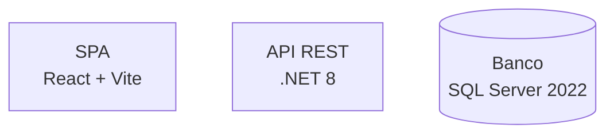

# Cascata de Detecção de Stack

A skill `reviewer-leanwork` é stack-agnóstica. A stack vem do projeto sob revisão, não da skill. Este guia descreve a ordem de detecção e como inferir padrões específicos por stack.

## Ordem de preferência

### 1. Proposta arquitetural (preferência máxima)

Procurar em `docs/architecture/proposta-arquitetural.md`. Quando existe, é a fonte mais confiável: a stack está justificada lá com base em ADRs.

**Onde olhar:**
- Seção 4 (Restrições): tabela `Stack` com tecnologia obrigatória
- Seção 5 (ADRs): decisões sobre stack tipicamente carregam justificativa
- Seção 6.2 (Containers): cada container declara tecnologia entre `<br/>` no rótulo

**Exemplo:**



Inferir: frontend React + Vite, backend .NET 8, banco SQL Server. Aplicar critérios desse universo no review.

### 2. CLAUDE.md do projeto

Procurar `CLAUDE.md` na raiz do repositório. Times maduros declaram stack e convenções aqui.

**Exemplo de bloco típico:**

```markdown
## Stack
- Backend: .NET 8, ASP.NET Core, EF Core 8
- Banco: SQL Server 2022
- Frontend: React 18 + Vite + TanStack Query
- Padrões: Clean Architecture com MediatR, FluentValidation, Serilog
- Naming: `XxxCommand`, `XxxQuery`, `XxxHandler`, `XxxValidator`
- Errors: BusinessException para erros de negócio (mapeados para HTTP 422)
- Testes: xUnit + FluentAssertions + Testcontainers
```

Quando o `CLAUDE.md` declara padrões, esses padrões viram critério de review automaticamente. Não inventar padrões diferentes mesmo que pareçam melhores — o review é sobre adequação ao projeto, não preferência.

### 3. Inspeção do repositório

Quando não há proposta nem `CLAUDE.md`, inspecionar arquivos-pista:

| Arquivo | Stack inferida |
|---------|----------------|
| `*.csproj`, `*.sln`, `global.json` | .NET (versão no `TargetFramework`) |
| `package.json` | Node.js / TypeScript / JS (deps revelam framework: React, Vue, Express, Next, Nest, etc.) |
| `pom.xml`, `build.gradle` | Java / Kotlin |
| `pyproject.toml`, `requirements.txt`, `setup.py` | Python (frameworks: Django, FastAPI, Flask via deps) |
| `Cargo.toml` | Rust |
| `go.mod` | Go |
| `Gemfile` | Ruby |
| `composer.json` | PHP |
| `mix.exs` | Elixir |
| `pubspec.yaml` | Dart / Flutter |

Para banco, procurar em:
- Connection strings (`appsettings.json`, `.env`, `application.yml`)
- Pacotes (`Npgsql`, `Microsoft.Data.SqlClient`, `mysql2`, `mongodb`, `redis`, etc.)
- Migrations (`migrations/`, `db/migrate/`, `prisma/schema.prisma`)

Para frontend:
- `package.json` deps (React, Vue, Svelte, Angular, Solid)
- Build config (`vite.config.ts`, `webpack.config.js`, `next.config.js`)

### 4. Pergunta direta

Se as três opções anteriores falharem, perguntar uma vez ao usuário:

> "Não encontrei a proposta arquitetural nem CLAUDE.md neste projeto, e a inspeção do repo foi inconclusiva. Qual a stack principal? (linguagem + framework principal + banco)"

Depois de receber a resposta, **sugerir documentar no `CLAUDE.md` do projeto** para evitar a pergunta em reviews futuras.

## O que fazer com a stack descoberta

### Padrões universais (independentes de stack)

Sempre aplicam, independentemente do que foi detectado:

- Nomes consistentes com convenções do projeto
- Tratamento de erro coerente
- Ausência de PII em logs
- Sem segredos hardcoded
- Sem dead code dentro do diff
- Async/concurrent correto (sem deadlock, sem race condition óbvia)
- Funções/métodos não excessivamente longos

### Padrões específicos da stack

**Lidos do `CLAUDE.md` do projeto.** A skill não traz padrões pré-definidos por stack. Por quê:

- Padrões evoluem rápido (.NET 8 vs .NET 6 já são diferentes em vários aspectos)
- Cada projeto tem seu sabor (uns usam MediatR, outros não; uns usam Result pattern, outros exceções)
- Skill hard-coded com padrões de 2025 estaria desatualizada em 2027

### Heurísticas mínimas por stack (quando o `CLAUDE.md` não declara)

Se o `CLAUDE.md` não existe ou não declara padrões específicos, e a stack foi inferida por inspeção, aplicar apenas heurísticas universais. **Não inventar** que "em .NET deveria ter MediatR" — isso é opinião, não regra do projeto.

O que registrar no relatório nesse caso:

> ⚠️ **Stack detectada por inspeção do repositório** (`.csproj` indica .NET 8). Padrões específicos do projeto não estão documentados em `CLAUDE.md` — foram aplicados apenas critérios universais de qualidade. Recomenda-se documentar convenções do time em `CLAUDE.md` para futuros reviews.

## Edge cases

### Mono-repo com múltiplas stacks

Identificar a stack do **diretório onde está o diff**, não do mono-repo todo. Exemplo: PR mexe em `apps/frontend/` (React) e em `apps/backend/` (.NET). Tratar como duas stacks no mesmo review, com seções separadas no relatório de qualidade do código.

### Stack em transição (legado + novo)

Se o projeto está migrando (ex.: AngularJS para Vue, ASP.NET Framework para ASP.NET Core), a proposta arquitetural ou ADR deve declarar qual é o "novo" e qual é o "legado em migração". Aplicar critérios diferentes:

- Código novo no padrão antigo dentro de área já migrada → Bloqueante ou Importante
- Código novo no padrão novo dentro de área legada → respeitar plano de migração (ADR)

### Stack não-mainstream

Para stacks menos comuns (Elixir, Rust, Crystal, Nim, etc.), o reviewer pode:
- Aplicar critérios universais
- Pedir ao usuário esclarecimento sobre convenções específicas se algo soar estranho
- Ser explícito sobre limitação no relatório

Não fingir conhecimento profundo de stack que não foi declarada no `CLAUDE.md`.

## Documentação da stack no relatório

Sempre incluir no preâmbulo do relatório de review:

```markdown
**Stack detectada:**
- Backend: .NET 8 / ASP.NET Core / EF Core 8
- Banco: SQL Server 2022
- Frontend: React 18 + Vite
- Fonte: proposta arquitetural (seção 6.2) + CLAUDE.md (raiz)

**Padrões específicos aplicados:**
- MediatR para comandos e queries (declarado em CLAUDE.md)
- FluentValidation para validação (declarado em CLAUDE.md)
- BusinessException para erros de negócio (declarado em CLAUDE.md)
- Naming `XxxCommand`/`XxxHandler` (declarado em CLAUDE.md)
```

Isso protege o reviewer: deixa explícito sobre quais critérios o review se baseia, e permite ao revisado contestar se algum padrão foi mal interpretado.
