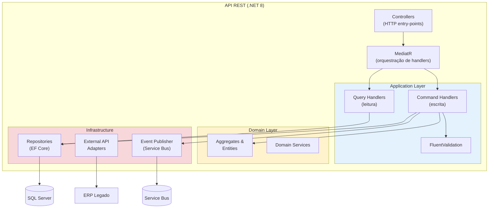

# Exemplo de Diagrama C4 — Nível 3 (Component), calibrado em .NET

Este é o mesmo exemplo do Nível 3 em `${CLAUDE_PLUGIN_ROOT}/skills/architect-leanwork/references/c4-mermaid-templates.md`, com bibliotecas reais de uma stack .NET (MediatR, FluentValidation, EF Core) no lugar dos nomes de padrão genéricos. Serve para ilustrar como o mesmo diagrama fica quando a stack já está decidida — não é a única forma válida de organizar a camada de aplicação.

> ⚠️ Este exemplo usa Clean/Onion Architecture com MediatR porque é uma combinação comum em projetos .NET, não porque a skill `architect-leanwork` recomenda esse padrão por padrão. A skill lista Clean Architecture entre os modismos a não adotar por moda — ver `SKILL.md`, seção de catálogo de atributos. Trate este diagrama como "assim fica *se* você escolher esse caminho", não como recomendação.

**Dicas:**
- Subgraphs para mostrar agrupamento lógico (camadas, módulos)
- Cores diferentes por camada ajudam a leitura
- Não detalhe classes individuais — é nível 3, não 4
