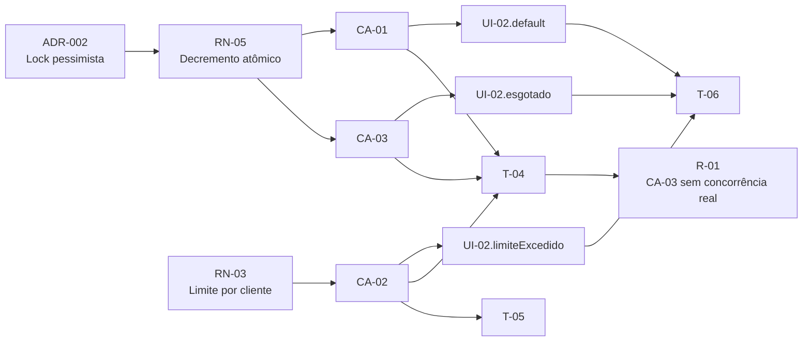

# Exemplo End-to-End — Pipeline SDD Leanwork (calibrado em .NET)

Este documento mostra os cinco artefatos do pipeline (arquitetura → PRD → SPEC-UI → plano → review) para uma demanda fictícia, com os IDs cruzados preenchidos. Serve como exemplo de calibração para as skills e como referência rápida do "como tudo se conecta".

**Este exemplo é calibrado em .NET/C#** (MediatR, EF Core, xUnit) só para ter código concreto em vez de pseudocódigo — as skills continuam stack-agnósticas, e o que se calibra aqui é o **cruzamento de IDs entre fases**, não a stack. Está em `stacks/dotnet/` (e não em `templates/`) exatamente por isso: é um exemplo aplicado a uma stack, não parte do núcleo agnóstico. Outras stacks podem ganhar seu próprio `stacks/<nome>/pipeline-example.md` seguindo a mesma estrutura de fragmentos.

As skills do pipeline apontam para este arquivo em "Recursos auxiliares". Quando ele diverge do que as skills produzem, é este arquivo que está errado — os templates em `references/` são a fonte de verdade da estrutura; aqui só se calibra o **cruzamento de IDs entre fases**.

## Demanda fictícia

> **Cliente:** Contoso
> **Demanda:** Implementar venda em "Ofertas Relâmpago" — produtos com estoque limitado a preço promocional, disponíveis por janela curta de tempo (15 minutos a 2 horas). Cliente pode comprar no máximo 1 unidade do produto em oferta. Estoque precisa ser decrementado de forma atômica para evitar overselling.

A demanda atravessa as cinco fases. Abaixo, fragmentos representativos de cada artefato — não são os documentos completos, e sim os trechos onde os IDs se cruzam.

---

## Fragmento 1 — Proposta Arquitetural (saída do `architect-leanwork`)

````markdown
# Proposta Arquitetural — Ofertas Relâmpago

## 5. Decisões arquiteturais (ADRs resumidos)

### ADR-002: Adotar lock pessimista no SQL Server para decremento de estoque em ofertas relâmpago

- **Contexto**: Cenário de Black Friday com até 500 req/s concorrentes no mesmo produto.
  Lock otimista (versionamento) resultaria em alta taxa de retentativas e UX ruim. Solução
  precisa garantir consistência forte porque overselling tem custo regulatório (ANVISA) e
  reputacional.
- **Decisão**: Usar `SELECT ... WITH (UPDLOCK, ROWLOCK)` ao ler o estoque dentro da
  transação de compra; commit libera o lock.
- **Justificativa**: Atende o atributo de qualidade "Consistência forte" priorizado para
  ofertas relâmpago. Trade-off aceito: throughput menor que solução com Redis + Lua,
  mas (a) o time já opera SQL Server, (b) volume previsto (50 produtos em oferta
  simultânea) cabe sem gargalo.
- **Alternativas consideradas**:
  - Redis com decremento atômico via Lua script — descartada porque adicionaria
    componente novo na stack para ganho marginal no volume previsto
  - Lock otimista com retry — descartada porque retentativas em alta concorrência
    degradam UX
- **Consequências**:
  - Positivas: garantia forte de não-overselling, sem novo componente de infra
  - Negativas / dívidas plantadas: throughput limitado pelo SQL Server (revisar se
    volume passar de 5x o atual)
````

---

## Fragmento 2 — PRD (saída do `prd-leanwork`)

````markdown
# PRD: Ofertas Relâmpago

## 8. Regras de negócio

- **RN-01**: Uma oferta relâmpago tem janela de validade definida por `inicio_em` e
  `fim_em` (UTC). Fora dessa janela, o produto volta ao preço regular.
- **RN-03**: Cada cliente pode comprar no máximo 1 unidade de um mesmo produto em oferta
  relâmpago. Tentativas adicionais retornam erro de negócio (não erro técnico).
- **RN-05**: O estoque da oferta é decrementado atomicamente no momento da confirmação
  da compra. Se o estoque chegar a zero antes do fim da janela, a oferta é encerrada
  automaticamente e mostrada como "esgotada". *(ADR-002)*
- **RN-07**: Compra em oferta relâmpago não pode ser cancelada pelo cliente após
  confirmada — apenas pelo SAC.

## 9. Critérios de aceite

```gherkin
Funcionalidade: Compra em Oferta Relâmpago

  Cenário [CA-01]: Cliente compra produto em oferta relâmpago com sucesso
    Dado que existe oferta ativa do produto X com 10 unidades (RN-01)
    E o cliente Y nunca comprou esse produto na oferta atual
    Quando o cliente Y confirma a compra de 1 unidade
    Então o estoque da oferta é decrementado para 9 unidades (RN-05)
    E o pedido é registrado com o preço promocional
    E o cliente recebe confirmação por e-mail

  Cenário [CA-02]: Cliente tenta comprar segunda unidade do mesmo produto em oferta
    Dado que o cliente Y já comprou 1 unidade do produto X na oferta atual (RN-03)
    Quando o cliente Y tenta comprar mais 1 unidade
    Então a compra é rejeitada com mensagem "Limite de 1 unidade por cliente nesta oferta"
    E o estoque da oferta não é alterado

  Cenário [CA-03]: Estoque da oferta esgota durante compras concorrentes
    Dado que existe oferta ativa do produto X com 1 unidade restante (RN-05)
    E dois clientes confirmam compra simultaneamente
    Quando o sistema processa as duas requisições
    Então apenas uma compra é confirmada com sucesso
    E a outra é rejeitada com mensagem "Produto esgotado nesta oferta"
    E o estoque final é 0
```
````

---

## Fragmento 3 — SPEC-UI (saída do `prototype-leanwork`)

Fase opcional: só existe porque esta demanda tem interface de cliente. Um PRD de integração
ou job não teria este fragmento, e a ausência não seria lacuna.

Repare que os dois estados de exceção não vieram do protótipo — foram **derivados dos
cenários Gherkin do Fragmento 2**. É o mecanismo central da fase: todo `Então` que descreve
rejeição, bloqueio ou mensagem de erro corresponde a um estado de tela.

````markdown
# SPEC-UI-001: Ofertas Relâmpago

> **PRD de referência:** `docs/prds/PRD-001-ofertas-relampago.md`
> **Modo:** Ingestão (protótipo HTML do Lovable)
> **Fidelidade:** Alta fidelidade
> **Status:** Aprovado

## 3. Inventário de telas

| ID | Tela | Rota | Persona | Implementa (RN) | Valida (CA) |
|---|---|---|---|---|---|
| UI-01 | Listagem de ofertas | `/ofertas` | Cliente | RN-01 | CA-01 |
| UI-02 | Checkout da oferta | `/ofertas/:id/checkout` | Cliente | RN-03, RN-05 | CA-01, CA-02, CA-03 |

## 4. Telas em detalhe

### UI-02 — Checkout da oferta

**Propósito:** confirmar a compra de 1 unidade do produto em oferta.

**Regras que se manifestam:**

| Regra | Como aparece na tela |
|---|---|
| RN-03 | Botão "Confirmar compra" desabilitado com aviso quando o cliente já comprou |
| RN-05 | Contador de unidades restantes; oferta esgotada bloqueia a confirmação |

**Estados:**

| Estado | ID | Quando ocorre | O que o usuário vê | Origem |
|---|---|---|---|---|
| Padrão | `UI-02.default` | Oferta ativa, cliente elegível | Resumo do item, preço promocional, botão ativo | Protótipo |
| Limite excedido | `UI-02.limiteExcedido` | Cliente já comprou (RN-03) | Alerta "Limite de 1 unidade por cliente nesta oferta" + link para a listagem | Derivado de CA-02 |
| Esgotado | `UI-02.esgotado` | Estoque zerou durante a sessão (RN-05) | Aviso "Produto esgotado nesta oferta" + botão desabilitado | Derivado de CA-03 |
| Carregando | `UI-02.carregando` | Confirmação em processamento | Botão em spinner, formulário travado | Derivado do PRD |

## 7. Cobertura do PRD

### Regras de negócio

| RN | Manifesta em | Status |
|---|---|---|
| RN-01 | UI-01 | ✅ Coberta |
| RN-03 | UI-02 (`.limiteExcedido`) | ✅ Coberta |
| RN-05 | UI-02 (`.esgotado`) | ✅ Coberta |
| RN-07 | — | ⚠️ Regra de backend (cancelamento pelo SAC) — sem interface neste PRD |

### Cenários Gherkin

| CA | Acontece em | Status |
|---|---|---|
| CA-01 | UI-01 → UI-02 (`.default`) | ✅ Coberto |
| CA-02 | UI-02 (`.limiteExcedido`) | ✅ Coberto |
| CA-03 | UI-02 (`.esgotado`) | ✅ Coberto |

## 8. Lacunas e pendências

| # | Lacuna | Impacto | Decisão necessária |
|---|---|---|---|
| 1 | `.limiteExcedido` e `.esgotado` não estavam no protótipo original | Derivados do PRD, não validados visualmente | Validar com design antes de implementar |
````

---

## Fragmento 4 — Plano de Execução (saída do `planner-leanwork`)

````markdown
# Plano de Execução: Ofertas Relâmpago

### Fase 2 — Lógica de negócio

#### T-04 — Implementar comando de compra com lock pessimista de estoque

- **Status:** Concluído
- **Complexidade:** Alta
- **Depende de:** T-02 (entity FlashSale), T-03 (migration)
- **Implementa:** RN-05, RN-03
- **Valida:** CA-01, CA-03
- **Decisões base:** ADR-002
- **Telas:** — *(tarefa sem interface)*
- **Camadas/arquivos afetados:**
  - `src/Contoso.Application/Features/FlashSale/Commands/ComprarOferta/ComprarOfertaHandler.cs` *(novo)*
  - `src/Contoso.Infrastructure/Persistence/Repositories/FlashSaleRepository.cs` *(novo)*

**Descrição:**
Handler MediatR que orquestra: (1) abre transação `Serializable`, (2) carrega oferta com
`SELECT ... WITH (UPDLOCK, ROWLOCK)`, (3) verifica estoque > 0 e limite por cliente,
(4) decrementa estoque, (5) cria pedido, (6) commit. Lança `BusinessException` em
violações de regra, deixando exceções técnicas subirem.

**Critério de aceite (testável):**
- [ ] Compra concorrente em estoque=1 resulta em exatamente 1 sucesso e 1 falha (CA-03)
- [ ] Segunda compra do mesmo cliente é rejeitada antes de tocar o estoque (CA-02 — nota: este CA-02 está em T-05)
- [ ] Decremento atômico verificável por teste de stress

**Testes a escrever:**
- *Unit:* `CA_01_Compra_com_sucesso_decrementa_estoque`,
  `CA_03_Compra_concorrente_respeita_estoque_atomico`
- *Integration:* `Compra_em_oferta_ativa_persiste_pedido_e_decrementa_estoque_no_banco`
- *Stress (xUnit + threads):* 100 compras concorrentes em estoque=10 → exatamente 10
  sucessos e 90 falhas; estoque final = 0

**Riscos / pontos de atenção:**
- Lock pessimista em produção tem custo de bloqueio — monitorar `sys.dm_tran_locks` na
  primeira janela de Black Friday
- Cuidado com timeout de transação em ambientes lentos — definir explicitamente
  `IsolationLevel.Serializable` e `CommandTimeout=10s`

---

#### T-05 — Implementar validador de limite por cliente

- **Status:** Pendente
- **Complexidade:** Baixa
- **Depende de:** T-04
- **Implementa:** RN-03
- **Valida:** CA-02
- **Decisões base:** —
- **Telas:** —
- **Camadas/arquivos afetados:**
  - `src/Contoso.Application/Features/FlashSale/Validators/ComprarOfertaValidator.cs` *(novo)*

[...]

---

### Fase 3 — Interface

#### T-06 — Implementar tela de checkout da oferta

- **Status:** Pendente
- **Complexidade:** Média
- **Depende de:** T-04
- **Implementa:** RN-03, RN-05
- **Valida:** CA-01, CA-02, CA-03
- **Decisões base:** —
- **Telas:** UI-02 (default, limiteExcedido, esgotado, carregando)
- **Camadas/arquivos afetados:**
  - `src/Contoso.Web/pages/ofertas/[id]/checkout.tsx` *(novo)*

**Critério de aceite (testável):**
- [ ] Os quatro estados de `UI-02` renderizam conforme a SPEC-UI
- [ ] `.limiteExcedido` mantém o resumo do item visível — o usuário não perde o contexto

[...]
````

---

## Fragmento 5 — Relatório de Review (saída do `reviewer-leanwork`)

O review fecha o ciclo: lê o código contra a tarefa, a tarefa contra o PRD, e devolve
`R-XX` rastreáveis. Aqui ele pega o defeito que o `/leanwork-trace` **não pega** — o trace
confirma que o nome do teste menciona `CA-03`, não que o teste prove `CA-03`.

````markdown
# Review: T-04 — Implementar comando de compra com lock pessimista de estoque

> **Plano de referência:** `docs/plans/PLAN-001-ofertas-relampago.md`
> **PRD de referência:** `docs/prds/PRD-001-ofertas-relampago.md`
> **Reviewer:** Claude (skill `reviewer-leanwork`)
> **Data:** 2026-06-15
> **Round:** 1
> **Recomendação final:** ⛔ Bloqueado

## Sumário executivo

O handler está bem estruturado e a ADR-002 foi respeitada literalmente. O bloqueio é de
cobertura: o teste que carrega o nome de `CA-03` não reproduz concorrência, então o
cenário que justifica a decisão arquitetural inteira segue sem prova.

**Cobertura da tarefa:**

| Item | Esperado | Entregue | Status |
|------|----------|----------|--------|
| Regras implementadas (RN) | RN-03, RN-05 | RN-03, RN-05 | ✅ |
| Cenários validados (CA) | CA-01, CA-03 | CA-01 | ⛔ CA-03 sem prova real |
| Decisões base (ADR) | ADR-002 | `UPDLOCK, ROWLOCK` aplicados | ✅ |
| Telas e estados (UI) | — (tarefa sem interface) | — | — |
| Testes prometidos | 4 | 3 | ⚠️ falta o de stress |

## Findings detalhados

### 🔴 Bloqueantes

#### R-01 — O teste de CA-03 não exercita concorrência

- **Eixo:** 4. Cobertura de teste
- **Referência cruzada:** CA-03, RN-05, ADR-002
- **Evidência:** `tests/Contoso.Application.Tests/FlashSale/ComprarOfertaHandlerTests.cs:88-104`
- **Descrição:** `CA_03_Compra_concorrente_respeita_estoque_atomico` dispara as duas
  compras em sequência, contra repositório em memória. Não há duas transações vivas ao
  mesmo tempo, então o `UPDLOCK` nunca é disputado e o teste passaria mesmo se o lock
  fosse removido do código.
- **Por quê é Bloqueante:** CA-03 é o único cenário que prova a ADR-002, e overselling
  tem custo regulatório declarado no contexto da decisão. Um teste que passa com o lock
  removido dá falsa segurança exatamente no ponto de maior risco.
- **Sugestão de correção:** promover para teste de integração com banco real e N threads,
  como já previsto em "Testes a escrever" da T-04 (*Stress*). Verificar que a versão sem
  `UPDLOCK` falha — teste de concorrência que não falha sem o lock não está testando o lock.

## Cobertura por CA (Valida)

### CA-01 — Cliente compra produto em oferta relâmpago com sucesso

- **Teste correspondente:** `ComprarOfertaHandlerTests.cs::CA_01_Compra_com_sucesso_decrementa_estoque`
- **Cobre o cenário Gherkin completo?** Sim — Dado/Quando/Então mapeados
- **Status:** ✅

### CA-03 — Estoque da oferta esgota durante compras concorrentes

- **Teste correspondente:** existe pelo nome, não pelo comportamento
- **Status:** ⛔ Ver R-01

## Notas ao processo (não-findings)

- **Plano precisa de atualização:** T-04 volta a `Status: Bloqueado` até R-01 ser
  resolvido. O round 2 vira `REVIEW-T-04-2026-06-17-round2.md`, com numeração de `R-XX`
  reiniciada e referência cruzada na seção "Round anterior".
````

---

## A matriz de rastreabilidade dessa demanda

Saída esperada do `/leanwork-trace`:

### Tabela 1 — Rastreabilidade direta

| RN | Descrição (truncada) | Validado por (CA) | Manifesta em (UI) | Implementado em (T) | Review (R) | Decisão base (ADR) |
|----|---------------------|-------------------|-------------------|---------------------|------------|---------------------|
| RN-01 | Janela de validade da oferta | CA-01 | UI-01 | T-02 (entity), T-04 | — | — |
| RN-03 | Limite 1 unidade por cliente | CA-02 | UI-02.limiteExcedido | T-04, T-05, T-06 | — | — |
| RN-05 | Decremento atômico de estoque | CA-01, CA-03 | UI-02.esgotado | T-04, T-06 | ⛔ R-01 (REVIEW-T-04-2026-06-15) | ADR-002 |
| RN-07 | Cancelamento só pelo SAC | (sem CA) | (sem UI — backend) | (sem T) | — | — |

> `R-XX` é numerado por relatório, não globalmente. Fora do arquivo de origem, citar
> qualificado — `R-01 (REVIEW-T-04-2026-06-15)` — porque `R-01` sozinho é ambíguo assim
> que existe mais de um relatório.

### Diagrama Mermaid



Repare que as arestas `CA → T` e `CA → UI → T` coexistem. Cenário que se manifesta em tela
passa pela `UI-XX`; cenário de backend puro vai direto do `CA-XX` para a `T-XX`. A cadeia
`ADR → RN → CA → UI → T → R` é a ordem completa, não uma exigência de que todo elo exista.

### Gaps apontados

- **RN-07 sem cenário Gherkin**: regra de "cancelamento só pelo SAC" declarada mas sem
  CA correspondente → **risco: regra não testada**. Provavelmente porque o cancelamento
  pelo SAC vai virar feature separada (PRD-002). Decidir: mover RN-07 para o outro PRD,
  ou adicionar CA-04 aqui.
- **CA-02 implementado em duas tarefas (T-04 e T-05)**: aceitável, mas redundante.
  T-04 já bloqueia antes do decremento; T-05 só duplica via FluentValidation. Avaliar
  se T-05 é necessária ou se vira teste a mais em T-04.
- **CA-03 com cobertura aparente**: o trace vê o teste `CA_03_*` e marca o elo como
  fechado. Foi o review que descobriu que o teste não prova o cenário. **O trace verifica
  menção, não execução** — os dois comandos são complementares, não substitutos.

---

## O que esse exemplo mostra

- **IDs cruzados preenchidos** em todos os artefatos
- **Anotação de ADR no PRD** (`(ADR-002)` ao lado de RN-05)
- **Anotação de RN no Gherkin** (`Dado que existe oferta ativa (RN-01)`)
- **Estado de tela derivado de cenário** (`UI-02.esgotado` nasce de CA-03, não do protótipo)
- **Tarefa que materializa decisão arquitetural** (T-04 cita ADR-002)
- **Tarefa de interface com estados nomeados** (T-06 declara `Telas: UI-02 (default, limiteExcedido, esgotado, carregando)`)
- **Finding que reabre a tarefa** (R-01 devolve T-04 para `Bloqueado`)
- **Lacunas reveladas pela matriz** (RN-07 sem CA, CA-02 com sobreposição)
- **Limite do trace exposto** (CA-03 parecia coberto; só o review viu que não)
- **Nomes de teste seguindo a convenção** `CA_XX_descricao`
