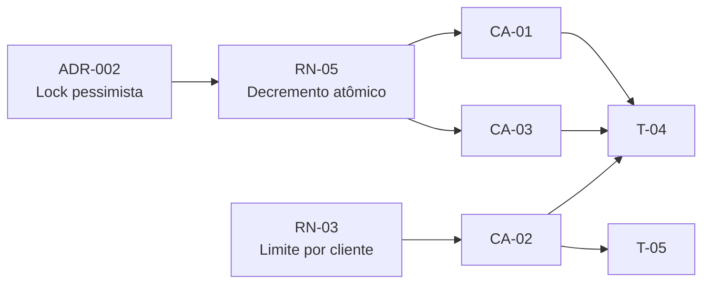

# Exemplo End-to-End — Pipeline SDD Leanwork

Este documento mostra os três artefatos do pipeline (arquitetura → PRD → plano) para uma demanda fictícia, com os IDs cruzados preenchidos. Serve como exemplo de calibração para as skills e como referência rápida do "como tudo se conecta".

## Demanda fictícia

> **Cliente:** Ultrafarma
> **Demanda:** Implementar venda em "Ofertas Relâmpago" — produtos com estoque limitado a preço promocional, disponíveis por janela curta de tempo (15 minutos a 2 horas). Cliente pode comprar no máximo 1 unidade do produto em oferta. Estoque precisa ser decrementado de forma atômica para evitar overselling.

A demanda passa pelas três fases. Abaixo, fragmentos representativos de cada artefato.

---

## Fragmento 1 — Proposta Arquitetural (saída do `architect-leanwork`)

```markdown
# Proposta Arquitetural — Ofertas Relâmpago

## 5. Decisões arquiteturais (ADRs resumidos)

### ADR-002: Adotar lock pessimista no SQL Server para decremento de estoque em ofertas relâmpago

- **Contexto**: Cenário de Black Friday com até 500 req/s concorrentes no mesmo produto.
  Lock otimista (versionamento) resultaria em alta taxa de retentativas e UX ruim. Solução
  precisa garantir consistência forte porque overselling tem custo regulatório (ANVISA) e
  reputacional.
- **Decisão**: Usar `SELECT ... WITH (UPDLOCK, ROWLOCK)` ao ler o estoque dentro da
  transação de compra; commit libera o lock.
- **Justificativa**: Atende o atributo de qualidade "Consistência forte" priorizado para
  ofertas relâmpago. Trade-off aceito: throughput menor que solução com Redis + Lua,
  mas (a) o time já opera SQL Server, (b) volume previsto (50 produtos em oferta
  simultânea) cabe sem gargalo.
- **Alternativas consideradas**:
  - Redis com decremento atômico via Lua script — descartada porque adicionaria
    componente novo na stack para ganho marginal no volume previsto
  - Lock otimista com retry — descartada porque retentativas em alta concorrência
    degradam UX
- **Consequências**:
  - Positivas: garantia forte de não-overselling, sem novo componente de infra
  - Negativas / dívidas plantadas: throughput limitado pelo SQL Server (revisar se
    volume passar de 5x o atual)
```

---

## Fragmento 2 — PRD (saída do `prd-leanwork`)

```markdown
# PRD: Ofertas Relâmpago

## 8. Regras de negócio

- **RN-01**: Uma oferta relâmpago tem janela de validade definida por `inicio_em` e
  `fim_em` (UTC). Fora dessa janela, o produto volta ao preço regular.
- **RN-03**: Cada cliente pode comprar no máximo 1 unidade de um mesmo produto em oferta
  relâmpago. Tentativas adicionais retornam erro de negócio (não erro técnico).
- **RN-05**: O estoque da oferta é decrementado atomicamente no momento da confirmação
  da compra. Se o estoque chegar a zero antes do fim da janela, a oferta é encerrada
  automaticamente e mostrada como "esgotada". *(ADR-002)*
- **RN-07**: Compra em oferta relâmpago não pode ser cancelada pelo cliente após
  confirmada — apenas pelo SAC.

## 9. Critérios de aceite

```gherkin
Funcionalidade: Compra em Oferta Relâmpago

  Cenário [CA-01]: Cliente compra produto em oferta relâmpago com sucesso
    Dado que existe oferta ativa do produto X com 10 unidades (RN-01)
    E o cliente Y nunca comprou esse produto na oferta atual
    Quando o cliente Y confirma a compra de 1 unidade
    Então o estoque da oferta é decrementado para 9 unidades (RN-05)
    E o pedido é registrado com o preço promocional
    E o cliente recebe confirmação por e-mail

  Cenário [CA-02]: Cliente tenta comprar segunda unidade do mesmo produto em oferta
    Dado que o cliente Y já comprou 1 unidade do produto X na oferta atual (RN-03)
    Quando o cliente Y tenta comprar mais 1 unidade
    Então a compra é rejeitada com mensagem "Limite de 1 unidade por cliente nesta oferta"
    E o estoque da oferta não é alterado

  Cenário [CA-03]: Estoque da oferta esgota durante compras concorrentes
    Dado que existe oferta ativa do produto X com 1 unidade restante (RN-05)
    E dois clientes confirmam compra simultaneamente
    Quando o sistema processa as duas requisições
    Então apenas uma compra é confirmada com sucesso
    E a outra é rejeitada com mensagem "Produto esgotado nesta oferta"
    E o estoque final é 0
```
```

---

## Fragmento 3 — Plano de Execução (saída do `planner-leanwork`)

```markdown
# Plano de Execução: Ofertas Relâmpago

### Fase 2 — Lógica de negócio

#### T-04 — Implementar comando de compra com lock pessimista de estoque

- [ ] **Status:** Pendente
- **Complexidade:** Alta
- **Depende de:** T-02 (entity FlashSale), T-03 (migration)
- **Implementa:** RN-05, RN-03
- **Valida:** CA-01, CA-03
- **Decisões base:** ADR-002
- **Camadas/arquivos afetados:**
  - `src/Ultrafarma.Application/Features/FlashSale/Commands/ComprarOferta/ComprarOfertaHandler.cs` *(novo)*
  - `src/Ultrafarma.Infrastructure/Persistence/Repositories/FlashSaleRepository.cs` *(novo)*

**Descrição:**
Handler MediatR que orquestra: (1) abre transação `Serializable`, (2) carrega oferta com
`SELECT ... WITH (UPDLOCK, ROWLOCK)`, (3) verifica estoque > 0 e limite por cliente,
(4) decrementa estoque, (5) cria pedido, (6) commit. Lança `BusinessException` em
violações de regra, deixando exceções técnicas subirem.

**Critério de aceite (testável):**
- [ ] Compra concorrente em estoque=1 resulta em exatamente 1 sucesso e 1 falha (CA-03)
- [ ] Segunda compra do mesmo cliente é rejeitada antes de tocar o estoque (CA-02 — nota: este CA-02 está em T-05)
- [ ] Decremento atômico verificável por teste de stress

**Testes a escrever:**
- *Unit:* `CA_01_Compra_com_sucesso_decrementa_estoque`,
  `CA_03_Compra_concorrente_respeita_estoque_atomico`
- *Integration:* `Compra_em_oferta_ativa_persiste_pedido_e_decrementa_estoque_no_banco`
- *Stress (xUnit + threads):* 100 compras concorrentes em estoque=10 → exatamente 10
  sucessos e 90 falhas; estoque final = 0

**Riscos / pontos de atenção:**
- Lock pessimista em produção tem custo de bloqueio — monitorar `sys.dm_tran_locks` na
  primeira janela de Black Friday
- Cuidado com timeout de transação em ambientes lentos — definir explicitamente
  `IsolationLevel.Serializable` e `CommandTimeout=10s`

---

#### T-05 — Implementar validador de limite por cliente

- [ ] **Status:** Pendente
- **Complexidade:** Baixa
- **Depende de:** T-04
- **Implementa:** RN-03
- **Valida:** CA-02
- **Decisões base:** —
- **Camadas/arquivos afetados:**
  - `src/Ultrafarma.Application/Features/FlashSale/Validators/ComprarOfertaValidator.cs` *(novo)*

[...]
```

---

## A matriz de rastreabilidade dessa demanda

Saída esperada do `/leanwork-trace`:

### Tabela 1 — Rastreabilidade direta

| RN | Descrição (truncada) | Validado por (CA) | Implementado em (T) | Decisão base (ADR) |
|----|---------------------|-------------------|---------------------|---------------------|
| RN-01 | Janela de validade da oferta | CA-01 | T-02 (entity), T-04 | — |
| RN-03 | Limite 1 unidade por cliente | CA-02 | T-04, T-05 | — |
| RN-05 | Decremento atômico de estoque | CA-01, CA-03 | T-04 | ADR-002 |
| RN-07 | Cancelamento só pelo SAC | (sem CA) | (sem T) | — |

### Diagrama Mermaid



### Gaps apontados

- **RN-07 sem cenário Gherkin**: regra de "cancelamento só pelo SAC" declarada mas sem
  CA correspondente → **risco: regra não testada**. Provavelmente porque o cancelamento
  pelo SAC vai virar feature separada (PRD-002). Decidir: mover RN-07 para o outro PRD,
  ou adicionar CA-04 aqui.
- **CA-02 implementado em duas tarefas (T-04 e T-05)**: aceitável, mas redundante.
  T-04 já bloqueia antes do decremento; T-05 só duplica via FluentValidation. Avaliar
  se T-05 é necessária ou se vira teste a mais em T-04.

---

## O que esse exemplo mostra

- **IDs cruzados preenchidos** em todos os artefatos
- **Anotação de ADR no PRD** (`(ADR-002)` ao lado de RN-05)
- **Anotação de RN no Gherkin** (`Dado que existe oferta ativa (RN-01)`)
- **Tarefa que materializa decisão arquitetural** (T-04 cita ADR-002)
- **Lacunas reveladas pela matriz** (RN-07 sem CA, CA-02 com sobreposição)
- **Nomes de teste seguindo a convenção** `CA_XX_descricao`
